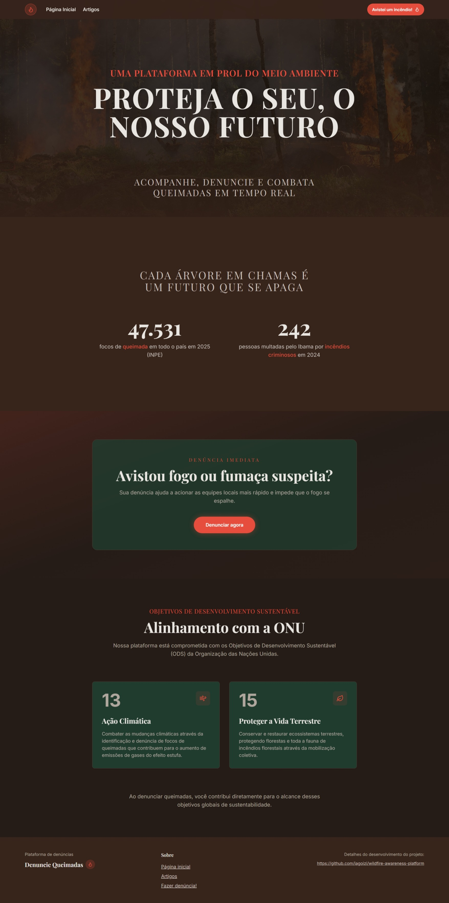
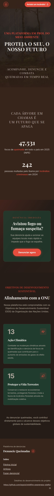
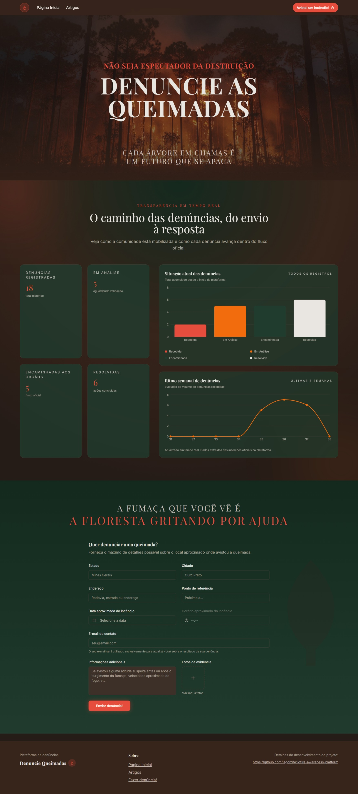
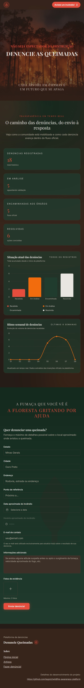
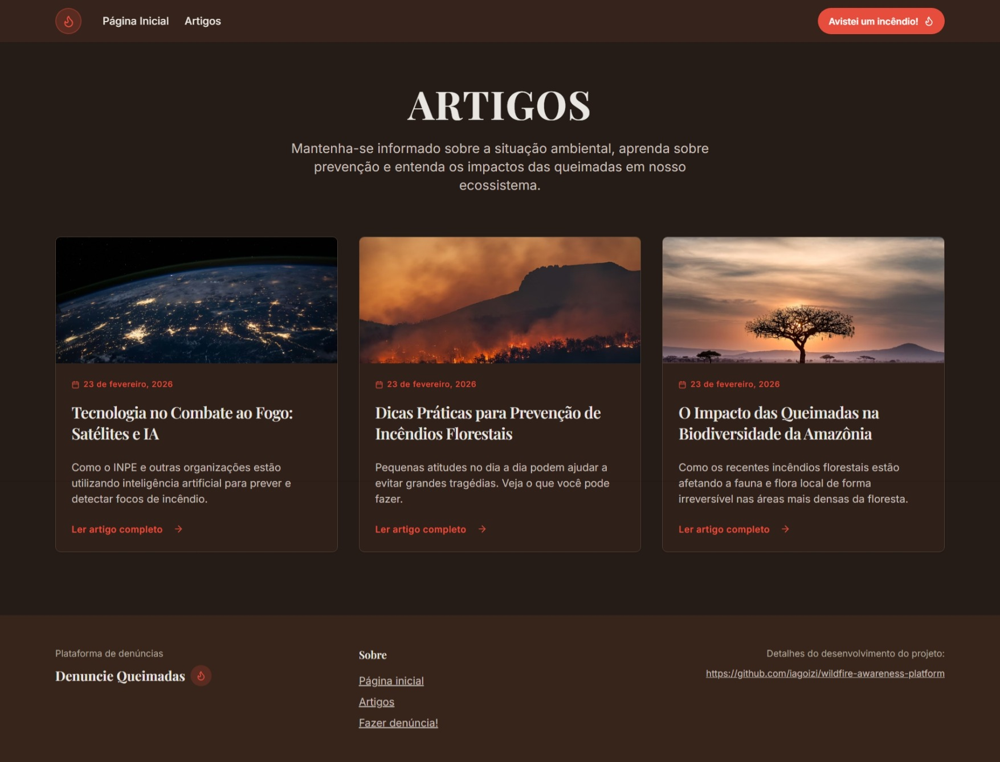
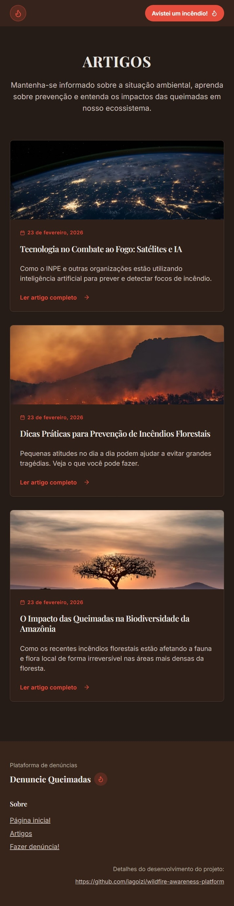
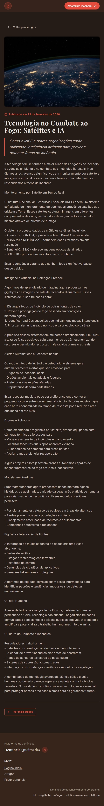
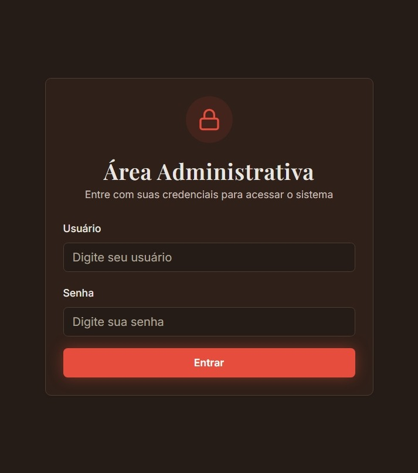
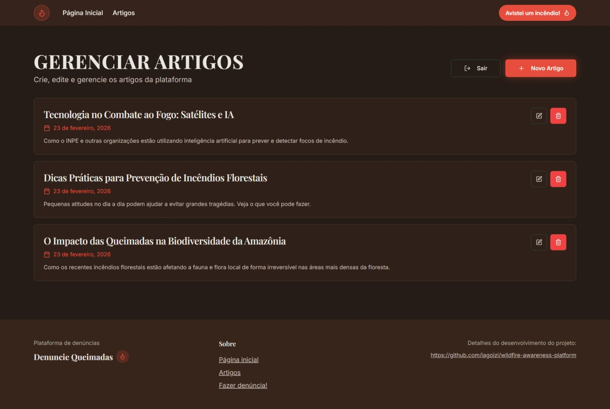
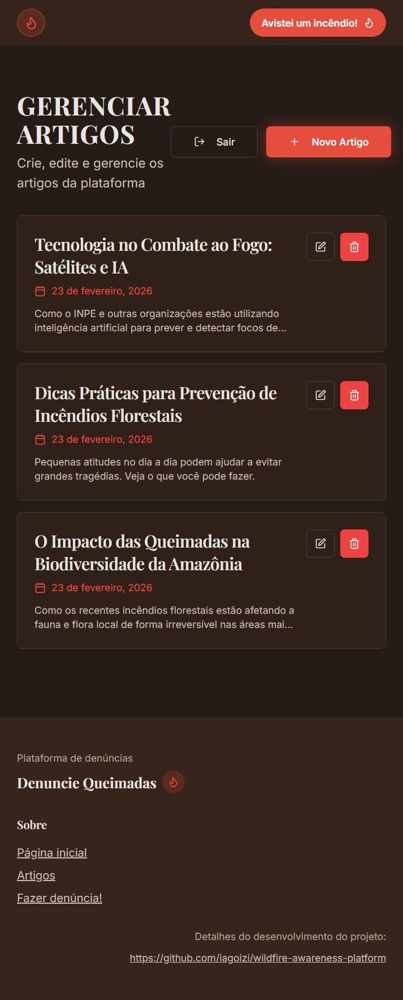

# 📦 Artefatos e Entregas

Este documento registra as evidências das funcionalidades implementadas, os códigos desenvolvidos e os resultados visuais alcançados até o momento no projeto **Wildfire Awareness Platform**.

---

## � Histórico Completo de Desenvolvimento

### Fase 1: Planejamento e Documentação Inicial (Novembro 2025)

#### Commit Inicial e Estruturação do Projeto
- **Commit:** `35826a0` - Initial commit
- **Autor:** Iago Izidório Lacerda
- **Descrição:** Inicialização do repositório do projeto

#### Documentação de Planejamento
- **Commits:** `1f7c087`, `b0e0190`, `7741d08`
- **Autor:** Iago Izidório Lacerda
- **Status:** ✅ Concluído
- **Descrição:** Criação da documentação inicial do projeto incluindo:
  - README com visão geral e contribuidores
  - Estrutura básica de documentação
  - Documento de requisitos inicial
- **Evidências:**
  - [README.md](https://github.com/iagoizi/wildfire-awareness-platform/blob/main/README.md)
  - [docs/requisitos.md](https://github.com/iagoizi/wildfire-awareness-platform/blob/main/docs/requisitos.md)

#### Diagramas e Planejamento Sistema
- **Commits:** `83fcb22`, `b0bf33b`, `8548eb7`, `5289901`
- **Autor:** Iago Izidório Lacerda
- **Status:** ✅ Concluído
- **Descrição:** Criação de diagramas de caso de uso e plano de projeto
  - Diagrama de casos de uso básico
  - Atualização para incluir serviços externos
  - Plano de milestones e issues
  - Links para rastreamento de issues

---

### Fase 2: Setup do Backend e Autenticação (Dezembro 2025)

#### Configuração Inicial do Backend
- **Commit:** `e1f0e71`
- **Autor:** Arthur Norberto
- **Status:** ✅ Concluído
- **Descrição:** Setup inicial do backend com Node.js e Express. Criação da pasta `src/web` para separar frontend do backend.
- **Evidências:**
  - [src/server/](https://github.com/iagoizi/wildfire-awareness-platform/tree/main/src/server)
  - [src/web/](https://github.com/iagoizi/wildfire-awareness-platform/tree/main/src/web)

#### Migração de Banco de Dados
- **Commits:** `ba29df0`, `6b8695f`
- **Autor:** Arthur Norberto
- **Status:** ✅ Concluído
- **Descrição:** 
  - Mudança de PostgreSQL para MariaDB
  - Posterior mudança para SQLite para simplificar desenvolvimento
- **Evidências:**
  - [schema.prisma](https://github.com/iagoizi/wildfire-awareness-platform/blob/main/src/server/prisma/schema.prisma)

#### Sistema de Autenticação JWT
- **Commit:** `161582a`
- **Autor:** Arthur Norberto
- **Status:** ✅ Concluído
- **Descrição:** Implementação de autenticação JWT e reestruturação do projeto
- **Evidências:**
  - [AuthController.js](https://github.com/iagoizi/wildfire-awareness-platform/blob/main/src/server/src/controllers/AuthController.js)
  - [middlewares/auth.js](https://github.com/iagoizi/wildfire-awareness-platform/blob/main/src/server/src/middlewares/auth.js)

#### Documentação de Artefatos
- **Commits:** `dbe7a95`, `db32816`
- **Autor:** Luiz H. Carvalho
- **Status:** ✅ Concluído
- **Descrição:** Criação e atualização do documento de artefatos e entregas
- **Evidências:**
  - [docs/artefatos.md](https://github.com/iagoizi/wildfire-awareness-platform/blob/main/docs/artefatos.md)

#### Integração Mailtrap
- **Commits:** `8fe5615`, `3110775`, `c8b0e77`, `8c7f242`
- **Autor:** Leandro Augf
- **Status:** ✅ Concluído
- **Descrição:** Implementação do serviço de email usando Mailtrap para desenvolvimento
- **Evidências:**
  - [mail/mailtrap.js](https://github.com/iagoizi/wildfire-awareness-platform/blob/main/src/mail/mailtrap.js)
  - [services/mailService.js](https://github.com/iagoizi/wildfire-awareness-platform/blob/main/src/server/src/services/mailService.js)

---

### Fase 3: Interface do Usuário e Formulários (Fevereiro 2026)

#### Correções de Build e PostCSS
- **Commit:** `135e407`
- **Autor:** Iago Izidório Lacerda
- **Status:** ✅ Concluído
- **Descrição:** Correção de erro PostCSS movendo import statement para o início do arquivo

#### Aprimoramento do Formulário de Denúncia
- **Commits:** `59867612`, `f5cdb02`, `4a94edb`, `6033c4d`, `0b13c62`
- **Autor:** Iago Izidório Lacerda
- **Status:** ✅ Concluído
- **Descrição:** Melhorias no formulário de denúncia de queimadas:
  - Adição de campo de horário com tooltip e acessibilidade
  - Ícone customizado de relógio com melhor visibilidade
  - Refinamento de placeholders
  - Reorganização do formulário
  - Atualização do favicon
- **Evidências:**
  - [ReportForm.tsx](https://github.com/iagoizi/wildfire-awareness-platform/blob/main/src/web/components/ReportForm.tsx)

#### Separação de Páginas
- **Commit:** `b079dc6`
- **Autor:** Iago Izidório Lacerda
- **Status:** ✅ Concluído
- **Descrição:** Refatoração para separar landing page e formulário de denúncia em páginas distintas
- **Evidências:**
  - [pages/Home.tsx](https://github.com/iagoizi/wildfire-awareness-platform/blob/main/src/web/pages/Home.tsx)
  - [pages/DenunciarQueimada.tsx](https://github.com/iagoizi/wildfire-awareness-platform/blob/main/src/web/pages/DenunciarQueimada.tsx)

---

### Fase 4: Conteúdo e Seções de Impacto

#### Seção ODS da ONU
- **Commits:** `68ae341`, `e2b1d01`
- **Autor:** Iago Izidório Lacerda
- **Status:** ✅ Concluído
- **Descrição:** 
  - Implementação da seção de Objetivos de Desenvolvimento Sustentável da ONU
  - Adição de seções informativas na página de denúncia
- **Evidências:**
  - [SDGSection.tsx](https://github.com/iagoizi/wildfire-awareness-platform/blob/main/src/web/components/SDGSection.tsx)

#### Hero Section e Animações
- **Commits:** `63721a6`, `9c66fd4`
- **Autor:** Iago Izidório Lacerda
- **Status:** ✅ Concluído
- **Descrição:**
  - Hero section personalizada para a home
  - Componente de números animados para estatísticas
- **Evidências:**
  - [HeroSectionHome.tsx](https://github.com/iagoizi/wildfire-awareness-platform/blob/main/src/web/components/HeroSectionHome.tsx)
  - [StatNumberAnimated.tsx](https://github.com/iagoizi/wildfire-awareness-platform/blob/main/src/web/components/StatNumberAnimated.tsx)

#### Call-to-Action e Navegação
- **Commits:** `83599a6`, `76f1478`, `9b16f32`, `e0abd9d`
- **Autor:** Iago Izidório Lacerda
- **Status:** ✅ Concluído
- **Descrição:**
  - Seção de CTA para denúncias
  - Scroll automático para o topo ao mudar de página
  - Ajustes de espaçamento vertical
  - Link do CTA direcionando para seção de denúncia
- **Evidências:**
  - [ReportCTASection.tsx](https://github.com/iagoizi/wildfire-awareness-platform/blob/main/src/web/components/ReportCTASection.tsx)
  - [ScrollToTop.tsx](https://github.com/iagoizi/wildfire-awareness-platform/blob/main/src/web/components/ScrollToTop.tsx)

#### Estatísticas com Gráficos
- **Commits:** `ab2b832`, `ef80fe6`
- **Autor:** Iago Izidório Lacerda
- **Status:** ✅ Concluído
- **Descrição:**
  - Seção de estatísticas de denúncias com gráficos
  - Criação de constante de rotas para melhor organização
- **Evidências:**
  - [ReportStatsSection.tsx](https://github.com/iagoizi/wildfire-awareness-platform/blob/main/src/web/components/ReportStatsSection.tsx)
  - [routes.ts](https://github.com/iagoizi/wildfire-awareness-platform/blob/main/src/web/routes.ts)

---

### Fase 5: Backend - Endpoints e Serviços (Fevereiro 2026)

#### Endpoints de Artigos (Blog/Notícias)
- **Commits:** `fa3b98e`, `a7d1746`, `874697b`, `313749c`
- **Autor:** Arthur Norberto
- **Status:** ✅ Concluído
- **Descrição:** Implementação completa da API de artigos:
  - GET /articles - Listagem de artigos
  - GET /articles/:id - Detalhes de um artigo
  - PUT /articles/:id - Atualização de artigo
  - DELETE /articles/:id - Deleção de artigo
- **Evidências:**
  - [ArticleController.js](https://github.com/iagoizi/wildfire-awareness-platform/blob/main/src/server/src/controllers/ArticleController.js)
  - [ArticleService.js](https://github.com/iagoizi/wildfire-awareness-platform/blob/main/src/server/src/services/ArticleService.js)

#### Endpoint de Denúncias e Estatísticas
- **Commits:** `223f927`, `1e8939d`, `49f3386`
- **Autor:** Arthur Norberto
- **Status:** ✅ Concluído
- **Descrição:**
  - Criação do FireService para lógica de negócio
  - POST /fire-reports - Endpoint de denúncia de queimadas
  - GET /impact-numbers - Endpoint de números de impacto/estatísticas
- **Evidências:**
  - [FireController.js](https://github.com/iagoizi/wildfire-awareness-platform/blob/main/src/server/src/controllers/FireController.js)
  - [FireService.js](https://github.com/iagoizi/wildfire-awareness-platform/blob/main/src/server/src/services/FireService.js)

#### Melhorias no README
- **Commits:** `aef598c`, `d72de0a`, `7a9816c`, `14bdce7`, `73f44a4`
- **Autor:** Luiz H. Carvalho
- **Status:** ✅ Concluído
- **Descrição:** Série de melhorias na documentação:
  - Atualização de cabeçalhos de seção
  - Melhorias na descrição do projeto
  - Reorganização da ordem dos componentes
  - Atualização do nome do projeto
  - Remoção de texto duplicado em artefatos

---

### Fase 6: Integração Frontend-Backend

#### Página de Artigos
- **Commit:** `9311c45`
- **Autor:** Luiz H. Carvalho
- **Status:** ✅ Concluído
- **Descrição:**
  - Implementação da página de listagem de artigos
  - Script concorrente para rodar backend e frontend simultaneamente
- **Evidências:**
  - [Articles.tsx](https://github.com/iagoizi/wildfire-awareness-platform/blob/main/src/web/pages/Articles.tsx)
  - [package.json - scripts](https://github.com/iagoizi/wildfire-awareness-platform/blob/main/package.json)

#### Integração de Estatísticas
- **Commit:** `0e8f1b8`
- **Autor:** Luiz H. Carvalho
- **Status:** ✅ Concluído
- **Descrição:** Conexão da seção de estatísticas com dados reais do backend
- **Evidências:**
  - [StatsSection.tsx](https://github.com/iagoizi/wildfire-awareness-platform/blob/main/src/web/components/StatsSection.tsx)
  - [lib/api.ts](https://github.com/iagoizi/wildfire-awareness-platform/blob/main/src/web/lib/api.ts)

---

### Fase 7: Funcionalidades Avançadas (Fevereiro 2026 - Recente)

#### Padronização de Versão Node.js
- **Commit:** `8bee83a`
- **Autor:** Iago Izidório Lacerda
- **Status:** ✅ Concluído
- **Descrição:** Criação de arquivo .nvmrc para padronizar versão do Node.js entre desenvolvedores

#### Melhorias no Sistema de Email
- **Commit:** `6cf9c05`
- **Autor:** Iago Izidório Lacerda
- **Status:** ✅ Concluído
- **Descrição:** Adição de campo de email no formulário de denúncia para CC nas notificações
- **Evidências:**
  - [FireService.js](https://github.com/iagoizi/wildfire-awareness-platform/blob/main/src/server/src/services/FireService.js)
  - [ReportForm.tsx](https://github.com/iagoizi/wildfire-awareness-platform/blob/main/src/web/components/ReportForm.tsx)

#### Upload de Fotos com Base64
- **Commits:** `cb7ecf9`, `99cfed`, `e8f478c`
- **Autor:** Iago Izidório Lacerda
- **Status:** ✅ Concluído
- **Descrição:**
  - Funcionalidade de upload de fotos no formulário de denúncia
  - Loading state durante submissão do formulário
  - Renderização de imagens no template de email HTML (base64 inline)
- **Evidências:**
  - [ReportForm.tsx - Upload](https://github.com/iagoizi/wildfire-awareness-platform/blob/main/src/web/components/ReportForm.tsx)
  - [FireService.js - Email Template](https://github.com/iagoizi/wildfire-awareness-platform/blob/main/src/server/src/services/FireService.js)
  - [schema.prisma - photos field](https://github.com/iagoizi/wildfire-awareness-platform/blob/main/src/server/prisma/schema.prisma)

#### Sistema de Artigos Completo
- **Commits:** `c43e2a3`, `0cb0c76`, `4177a37`
- **Autor:** Iago Izidório Lacerda
- **Status:** ✅ Concluído
- **Descrição:**
  - Script de seed para popular artigos de teste no banco de dados
  - Correção de URLs de imagens dos artigos (Unsplash)
  - Página de detalhes de artigo individual
- **Evidências:**
  - [seed-articles.js](https://github.com/iagoizi/wildfire-awareness-platform/blob/main/src/server/seed-articles.js)
  - [ArticleDetail.tsx](https://github.com/iagoizi/wildfire-awareness-platform/blob/main/src/web/pages/ArticleDetail.tsx)

#### CRM de Gerenciamento de Artigos
- **Commit:** `264e34f`
- **Autor:** Iago Izidório Lacerda
- **Status:** ✅ Concluído
- **Descrição:** Interface administrativa completa para CRUD de artigos
  - Listagem de artigos
  - Criação de novos artigos com geração automática de slug
  - Edição de artigos existentes
  - Exclusão de artigos com confirmação
  - Interface responsiva com modais e alertas
- **Evidências:**
  - [CRM/ArticleManager.tsx](https://github.com/iagoizi/wildfire-awareness-platform/blob/main/src/web/pages/CRM/ArticleManager.tsx)

#### Sistema de Autenticação Administrativa
- **Commit:** `df785d9`
- **Autor:** Iago Izidório Lacerda
- **Status:** ✅ Concluído
- **Descrição:** Sistema completo de autenticação para acesso ao CRM:
  - Página de login em /crm com credenciais baseadas em variáveis de ambiente
  - AuthContext para gerenciamento de estado de autenticação global
  - Componente PrivateRoute para proteção de rotas
  - Endpoint de login no backend validando credenciais do .env
  - Armazenamento de token JWT no localStorage com expiração de 24h
  - Botão de logout no ArticleManager com feedback visual
  - Fluxo completo: login → armazenamento de token → proteção de rota → logout
- **Evidências:**
  - [CRM/Login.tsx](https://github.com/iagoizi/wildfire-awareness-platform/blob/main/src/web/pages/CRM/Login.tsx)
  - [contexts/AuthContext.tsx](https://github.com/iagoizi/wildfire-awareness-platform/blob/main/src/web/contexts/AuthContext.tsx)
  - [components/PrivateRoute.tsx](https://github.com/iagoizi/wildfire-awareness-platform/blob/main/src/web/components/PrivateRoute.tsx)
  - [AuthController.js - adminLogin](https://github.com/iagoizi/wildfire-awareness-platform/blob/main/src/server/src/controllers/AuthController.js)

---

## 🎯 Funcionalidades Implementadas

### Frontend (React + TypeScript + Vite)
- ✅ Landing page responsiva com hero section
- ✅ Sistema de roteamento SPA (React Router)
- ✅ Biblioteca de componentes UI (Shadcn/UI + Tailwind)
- ✅ Formulário de denúncia de queimadas com upload de fotos
- ✅ Seção de ODS da ONU
- ✅ Seções de estatísticas com gráficos
- ✅ Call-to-action para denúncias
- ✅ Scroll automático ao trocar de página
- ✅ Página de listagem de artigos/notícias
- ✅ Página de detalhes de artigo
- ✅ Sistema de autenticação com Context API
- ✅ CRM administrativo para gerenciamento de artigos
- ✅ Interface de login para administradores
- ✅ Proteção de rotas privadas

### Backend (Node.js + Express + Prisma + SQLite)
- ✅ API RESTful com Express
- ✅ Banco de dados SQLite com Prisma ORM
- ✅ Sistema de autenticação JWT
- ✅ Endpoint de registro e login de usuários
- ✅ Endpoint de login administrativo com credenciais do ambiente
- ✅ CRUD completo de artigos (Create, Read, Update, Delete)
- ✅ Endpoint de denúncia de queimadas
- ✅ Endpoint de estatísticas de impacto
- ✅ Serviço de email com Mailtrap
- ✅ Template HTML de email com imagens inline (base64)
- ✅ Armazenamento de fotos em base64 no banco
- ✅ Middleware de autenticação JWT
- ✅ Script de seed para popular dados de teste

### DevOps e Configuração
- ✅ Padronização de versão Node.js (.nvmrc)
- ✅ Scripts concorrentes para dev (frontend + backend)
- ✅ Variáveis de ambiente para configuração sensível
- ✅ Migrations de banco de dados com Prisma
- ✅ Documentação completa no README

---

## 📸 Evidências Visuais

Abaixo estão as capturas de tela demonstrando a interface rodando em ambiente local.

### Tela Inicial (Desktop)
> Visão geral da Landing Page com navegação e CTA principal.

### Responsividade (Mobile)
> Adaptação da interface para dispositivos móveis, garantindo acessibilidade em campo.

### Página de Denúncia (Desktop)
> Formulário e contexto de denúncia em desktop.

### Página de Denúncia (Mobile)
> Formulário de denúncia adaptado para mobile.

### Página de Artigos (Desktop)
> Listagem de artigos em tela grande.

### Página de Artigos (Mobile)
> Listagem de artigos em tela pequena.

### Detalhe de Artigo (Mobile)
> Visualização completa de artigo em mobile.

### CRM - Login Administrativo
> Tela de acesso ao painel de gerenciamento.

### CRM - Gerenciamento de Artigos (Desktop)
> Painel administrativo em desktop.

### CRM - Gerenciamento de Artigos (Mobile)
> Painel administrativo adaptado para mobile.

---

## 👥 Contribuidores

- **Iago Izidório Lacerda** - Frontend, UI/UX, Integração, Sistema de Autenticação
- **Arthur Norberto** - Backend, APIs, Banco de Dados
- **Luiz H. Carvalho** - Frontend, Documentação, Integração
- **Leandro Augf** - Backend, Sistema de Email

---

## 📊 Estatísticas do Projeto

- **Total de Commits:** 80+
- **Branches Principais:** main, feature/articles, feature/images-as-base64-on-db, fix/smtp
- **Período de Desenvolvimento:** Novembro 2025 - Fevereiro 2026
- **Linguagens:** TypeScript, JavaScript
- **Frameworks:** React, Express, Prisma
- **Banco de Dados:** SQLite
