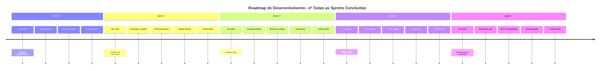

# Planejamento das Sprints - Plataforma de Denúncia de Queimadas

## 📋 Visão Geral do Projeto

**Status:** ✅ **PROJETO CONCLUÍDO COM SUCESSO**

**Quadro Kanban:** [Acesse o quadro de atividades aqui](https://github.com/users/iagoizi/projects/2)

**Duração do Projeto:** Novembro 2025 - Fevereiro 2026 (4 meses)  
**Total de Sprints:** 5 (0-4) - Todas Concluídas ✅  
**Metodologia:** Scrum com sprints de 2 semanas

---

## 🎯 Objetivos por Sprint

### [**Sprint 0 - SETUP** (Concluída)](https://github.com/iagoizi/wildfire-awareness-platform/milestone/1)
**Período:** 10/11/2025 - 28/11/2025  
**Objetivo Principal:** Configuração do ambiente de desenvolvimento e infraestrutura básica

**Tarefas Realizadas:**
- ✅ [[BE] Setup Mailtrap #32](https://github.com/iagoizi/wildfire-awareness-platform/issues/32)
- ✅ [[BE] Setup servidor #33](https://github.com/iagoizi/wildfire-awareness-platform/issues/33)
- ✅ [[BE] Setup GCP #24](https://github.com/iagoizi/wildfire-awareness-platform/issues/34)
- ✅ [[BE] Setup banco de dados #35](https://github.com/iagoizi/wildfire-awareness-platform/issues/35)
- ✅ [[FE] Setup estrutura inicial do projeto #36](https://github.com/iagoizi/wildfire-awareness-platform/issues/36)
- ✅ [[FE] Setup deploy automático #37](https://github.com/iagoizi/wildfire-awareness-platform/issues/37)
- ✅ [[FE] Styleguide - Botões #3](https://github.com/iagoizi/wildfire-awareness-platform/issues/3)
- ✅ [[FE] Styleguide - Inputs #4](https://github.com/iagoizi/wildfire-awareness-platform/issues/4)
- ✅ [[FE] Styleguide - Input de Data #6](https://github.com/iagoizi/wildfire-awareness-platform/issues/5)
- ✅ [[FE] Styleguide - Tipografia #38](https://github.com/iagoizi/wildfire-awareness-platform/issues/38)

**Entregáveis:** Ambiente de desenvolvimento configurado, repositório estruturado, styleguide inicial

---

### [**Sprint 1 - Formulário de Denúncias** (Concluída)](https://github.com/iagoizi/wildfire-awareness-platform/milestone/2)
**Período:** 29/11/2025 - 19/12/2025  
**Objetivo Principal:** Implementação completa do sistema de registro de denúncias (CU-01)

**Tarefas Realizadas:**
- ✅ Formulário de denúncia completo #2
- ✅ Backend para recebimento e armazenamento de denúncias
- ✅ Sistema de upload de fotos com base64
- ✅ Template HTML de email com imagens inline
- ✅ Campo de email para cópia da denúncia
- ✅ Loading states durante submissão
- ✅ Validação de dados no cliente e servidor

**Entregáveis:** 
- ✅ Formulário funcional com upload de múltiplas fotos
- ✅ API REST POST /fire-reports
- ✅ Sistema de armazenamento de imagens em base64
- ✅ Email de confirmação com template HTML e fotos
- ✅ Banco de dados com tabela FireSpot (email e photos)

---

### [**Sprint 2 - Landing Page** (Concluída)](https://github.com/iagoizi/wildfire-awareness-platform/milestone/3)
**Período:** 20/12/2025 - 09/01/2026  
**Objetivo Principal:** Desenvolvimento da landing page pública e sistema de visualização de conteúdo

**Tarefas Realizadas:**
- ✅ Landing page responsiva com hero section personalizada
- ✅ Seção de ODS da ONU
- ✅ Seção de estatísticas com gráficos e números animados
- ✅ Call-to-action para denúncias
- ✅ Scroll automático ao trocar de página
- ✅ Separação em páginas distintas (Home e Denunciar Queimada)
- ✅ Sistema de roteamento SPA com React Router
- ✅ Página de listagem de artigos
- ✅ Página de detalhes de artigos
- ✅ Integração com backend para estatísticas reais

**Entregáveis:**
- ✅ Landing page completa e responsiva
- ✅ Sistema de visualização de artigos (CU-02)
- ✅ Componentes reutilizáveis (Shadcn/UI + Tailwind)
- ✅ Integração frontend-backend para estatísticas

**Casos de Uso Atendidos:** CU-02 (completo)

---

### [**Sprint 3 - Blog de Notícias e CMS** (Concluída)](https://github.com/iagoizi/wildfire-awareness-platform/milestone/4)
**Período:** 10/01/2026 - 30/01/2026  
**Objetivo Principal:** Implementação do CMS para publicação de conteúdo educativo

**Tarefas Realizadas:**
- ✅ API completa de artigos (CRUD)
  - GET /articles - Listagem
  - GET /articles/:id - Detalhes
  - POST /articles - Criação
  - PUT /articles/:id - Atualização
  - DELETE /articles/:id - Deleção
- ✅ Painel CRM para gestão de artigos em /crm/artigos
- ✅ Interface de criação/edição com modais
- ✅ Geração automática de slug a partir do título
- ✅ Sistema de confirmação para exclusão
- ✅ Script de seed para popular artigos de teste
- ✅ Correção de URLs de imagens dos artigos

**Entregáveis:**
- ✅ Backend completo para gerenciamento de artigos
- ✅ Interface administrativa (CRM) responsiva
- ✅ Sistema de slug automático
- ✅ Dados de teste para desenvolvimento

**Casos de Uso Atendidos:** CU-04 (completo), CU-03 (completo)

---

### [**Sprint 4 - Autenticação, Segurança e Finalização** (Concluída)](https://github.com/iagoizi/wildfire-awareness-platform/milestone/5)
**Período:** 31/01/2026 - 23/02/2026  
**Objetivo Principal:** Finalização do projeto com sistema de autenticação e documentação

**Tarefas Realizadas:**
- ✅ Sistema completo de autenticação administrativa
  - Página de login em /crm
  - AuthContext para gerenciamento de estado global
  - PrivateRoute para proteção de rotas
  - Endpoint de login com validação de credenciais do .env
  - Armazenamento JWT no localStorage (24h expiry)
  - Botão de logout com feedback visual
- ✅ Padronização de versão Node.js (.nvmrc)
- ✅ Correções de build e PostCSS
- ✅ Melhorias no formulário de denúncia
- ✅ Documentação completa atualizada
- ✅ Scripts concorrentes para desenvolvimento

**Entregáveis:**
- ✅ Sistema de autenticação JWT completo
- ✅ Proteção de rotas administrativas
- ✅ Credenciais baseadas em variáveis de ambiente
- ✅ Documentação técnica completa (artefatos.md)
- ✅ Plataforma funcional pronta para deploy

---

## 📊 Roadmap do Produto (Concluído)

---

## 🎯 Metas de Entrega por Sprint

| Sprint | Funcionalidades Principais | Entregáveis | Status |
|--------|---------------------------|-------------|---------|
| 0 | Infraestrutura | Ambiente configurado | ✅ Concluída |
| 1 | Denúncias | Formulário funcional + Upload de fotos | ✅ Concluída |
| 2 | Conteúdo Público | Landing page + Artigos + Estatísticas | ✅ Concluída |
| 3 | CMS | Painel admin + CRUD artigos | ✅ Concluída |
| 4 | Autenticação & Docs | Sistema de auth + Documentação | ✅ Concluída |

---

## 👥 Distribuição de Responsabilidades

### **Backend (BE)**
- Setup de servidores e bancos de dados
- APIs REST para denúncias e conteúdo
- Integrações com serviços externos (email, armazenamento)
- Segurança e autenticação

### **Frontend (FE)**
- Interfaces de usuário responsivas
- Formulários e validação no cliente
- Consumo de APIs
- Experiência do usuário (UX)

### **Full Stack**
- Integração frontend/backend
- Deploy e configuração de ambiente
- Testes end-to-end

---

*Última atualização: 23/02/2026*  
*Status: Projeto Concluído - Todas as sprints finalizadas*

**Link para acompanhamento:** [Quadro Kanban do Projeto](https://github.com/users/iagoizi/projects/2)

---

## 🎉 Resumo Final do Projeto

**Status:** ✅ **Concluído com Sucesso**

**Período Total:** Novembro 2025 - Fevereiro 2026 (4 meses)

**Principais Conquistas:**
- ✅ Sistema completo de denúncias com upload de fotos
- ✅ Landing page responsiva com seções informativas
- ✅ Blog/CMS administrativo com CRUD completo
- ✅ Sistema de autenticação e proteção de rotas
- ✅ Integração de email com templates HTML
- ✅ API RESTful completa e documentada
- ✅ Interface administrativa (CRM) funcional
- ✅ Documentação técnica completa

**Tecnologias Utilizadas:**
- **Frontend:** React, TypeScript, Vite, TailwindCSS, Shadcn/UI
- **Backend:** Node.js, Express, Prisma ORM, SQLite
- **Autenticação:** JWT com localStorage
- **Email:** Nodemailer + Mailtrap
- **Deploy:** Pronto para produção

**Equipe:**
- **Iago Izidório Lacerda** - Frontend, UI/UX, Integração, Sistema de Autenticação
- **Arthur Norberto** - Backend, APIs, Banco de Dados
- **Luiz H. Carvalho** - Frontend, Documentação, Integração
- **Leandro Augf** - Backend, Sistema de Email