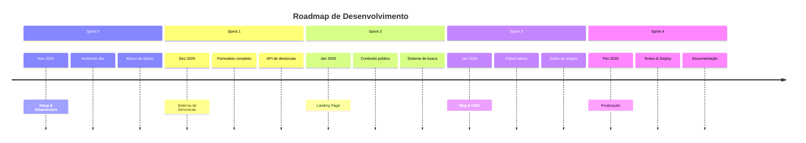

# Planejamento das Sprints - Plataforma de Denúncia de Queimadas

## 📋 Visão Geral do Projeto

**Quadro Kanban:** [Acesse o quadro de atividades aqui](https://github.com/users/iagoizi/projects/2)

**Duração do Projeto:** Novembro 2025 - Fevereiro 2026  
**Total de Sprints:** 5 (0-4)  
**Metodologia:** Scrum com sprints de 2 semanas

---

## 🎯 Objetivos por Sprint

### [**Sprint 0 - SETUP** (Concluída)](https://github.com/iagoizi/wildfire-awareness-platform/milestone/1)
**Período:** 10/11/2025 - 28/11/2025  
**Objetivo Principal:** Configuração do ambiente de desenvolvimento e infraestrutura básica

**Tarefas Realizadas:**
- ✅ [[BE] Setup Mailtrap #32](https://github.com/iagoizi/wildfire-awareness-platform/issues/32)
- ✅ [[BE] Setup servidor #33](https://github.com/iagoizi/wildfire-awareness-platform/issues/33)
- ✅ [[BE] Setup GCP #24](https://github.com/iagoizi/wildfire-awareness-platform/issues/34)
- ✅ [[BE] Setup banco de dados #35](https://github.com/iagoizi/wildfire-awareness-platform/issues/35)
- ✅ [[FE] Setup estrutura inicial do projeto #36](https://github.com/iagoizi/wildfire-awareness-platform/issues/36)
- ✅ [[FE] Setup deploy automático #37](https://github.com/iagoizi/wildfire-awareness-platform/issues/37)
- ✅ [[FE] Styleguide - Botões #3](https://github.com/iagoizi/wildfire-awareness-platform/issues/3)
- ✅ [[FE] Styleguide - Inputs #4](https://github.com/iagoizi/wildfire-awareness-platform/issues/4)
- ✅ [[FE] Styleguide - Input de Data #6](https://github.com/iagoizi/wildfire-awareness-platform/issues/5)
- ✅ [[FE] Styleguide - Tipografia #38](https://github.com/iagoizi/wildfire-awareness-platform/issues/38)

**Entregáveis:** Ambiente de desenvolvimento configurado, repositório estruturado, styleguide inicial

---

### [**Sprint 1 - Formulário de Denúncias** (Em Andamento)](https://github.com/iagoizi/wildfire-awareness-platform/milestone/2)
**Período:** 29/11/2025 - 19/12/2025  
**Objetivo Principal:** Implementação completa do sistema de registro de denúncias (CU-01)

**Tarefas Atuais:**
- [ ] Formulário de denúncia #2
- [ ] Outras tarefas relacionadas ao formulário de denúncia (lista completa no quadro Kanban)

**Objetivos Específicos:**
1. Frontend do formulário com todas as seções
2. Backend para recebimento e armazenamento de denúncias
3. Validação de dados no cliente e servidor
4. Upload de imagens com preview
5. Geração de protocolo único
6. Envio de email de confirmação (Mailtrap)

**Entregáveis Esperados:** 
- Formulário funcional para registro de denúncias
- API REST para denúncias
- Sistema de upload de imagens
- Banco de dados com tabela de denúncias

---

### [**Sprint 2 - Landing Page** (Próxima)](https://github.com/iagoizi/wildfire-awareness-platform/milestone/3)
**Período:** 20/12/2025 - 09/01/2026  
**Objetivo Principal:** Desenvolvimento da landing page pública e sistema de visualização de conteúdo

**Objetivos Específicos:**
1. Landing page responsiva com informações sobre o projeto
2. Sistema de visualização de artigos (CU-02)
3. Sistema de busca básico (CU-03)
4. Menu de navegação completo
5. Página "Sobre" e "Como funciona"
6. Integração com redes sociais

**Casos de Uso Atendidos:** CU-02, CU-03 (parcialmente)

---

### [**Sprint 3 - Blog de Notícias** (Futura)](https://github.com/iagoizi/wildfire-awareness-platform/milestone/4)
**Período:** 10/01/2026 - 30/01/2026  
**Objetivo Principal:** Implementação do CMS para publicação de conteúdo educativo

**Objetivos Específicos:**
1. Painel administrativo para gestão de conteúdo
2. Editor WYSIWYG para artigos (CU-04)
3. Sistema de categorias e tags
4. Comentários nos artigos (opcional)
5. SEO básico para artigos
6. Sistema de rascunhos e agendamento

**Casos de Uso Atendidos:** CU-04 (completo), CU-03 (completo)

---

### [**Sprint 4 - Correção de Bugs, Ajustes e Deploy** (Futura)](https://github.com/iagoizi/wildfire-awareness-platform/milestone/5)
**Período:** 31/01/2026 - 20/02/2026  
**Objetivo Principal:** Finalização do projeto, testes e deploy em produção

**Objetivos Específicos:**
1. Testes de usabilidade e correção de bugs
2. Otimização de performance
3. Implementação de segurança adicional
4. Deploy em ambiente de produção
5. Documentação final do projeto
6. Treinamento para administradores (se aplicável)

**Entregáveis Finais:** Plataforma completa em produção, documentação técnica, manual do usuário

---

## 📊 Roadmap do Produto

---

## 🎯 Metas de Entrega por Sprint

| Sprint | Funcionalidades Principais | Entregáveis | Status |
|--------|---------------------------|-------------|---------|
| 0 | Infraestrutura | Ambiente configurado | ✅ Concluída |
| 1 | Denúncias | Formulário funcional | 🔄 Em andamento |
| 2 | Conteúdo Público | Landing page + visualização | ⏳ Planejada |
| 3 | CMS | Painel admin + editor | ⏳ Planejada |
| 4 | Finalização | Plataforma em produção | ⏳ Planejada |

---

## 👥 Distribuição de Responsabilidades

### **Backend (BE)**
- Setup de servidores e bancos de dados
- APIs REST para denúncias e conteúdo
- Integrações com serviços externos (email, armazenamento)
- Segurança e autenticação

### **Frontend (FE)**
- Interfaces de usuário responsivas
- Formulários e validação no cliente
- Consumo de APIs
- Experiência do usuário (UX)

### **Full Stack**
- Integração frontend/backend
- Deploy e configuração de ambiente
- Testes end-to-end

---

*Última atualização: 13/12/2025*  
*Próxima revisão: 19/12/2025*

**Link para acompanhamento:** [Quadro Kanban do Projeto](https://github.com/users/iagoizi/projects/2)