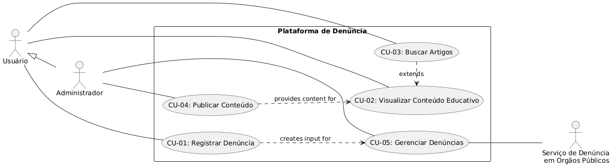

# Requisitos do Sistema - Plataforma de Conscientização e Denúncia de Queimadas

## 📋 Visão Geral

Este documento especifica os requisitos funcionais e não-funcionais da plataforma, organizados através de Histórias de Usuário e Diagramas de Casos de Uso.

---

## 👥 Personas

### 1. Cidadão Consciente (Maria, 35 anos)
- **Perfil:** Moradora urbana, preocupada com questões ambientais
- **Necessidades:** Informações confiáveis, ferramenta prática para denunciar
- **Habilidades:** Usa smartphone, familiarizada com redes sociais

### 2. Agricultor Local (João, 52 anos)
- **Perfil:** Vive em zona rural, testemunha frequente de queimadas
- **Necessidades:** Denunciar rapidamente
- **Habilidades:** Usa celular básico, conexão intermitente

### 3. Educador Ambiental (Ana, 28 anos)
- **Perfil:** Professora, ativista ambiental
- **Necessidades:** Materiais educativos, dados para aulas
- **Habilidades:** Alta familiaridade com tecnologia

### 4. Gestor Público (Carla, 45 anos)
- **Perfil:** Funcionária de órgão ambiental
- **Necessidades:** Dados agregados, gestão de denúncias
- **Habilidades:** Experiência com sistemas web

---

## 📖 Histórias de Usuário

### EPIC 1: Conscientização e Educação

#### US 1.1 - Visualizar Conteúdo Educativo
**Como** um cidadão interessado em meio ambiente  
**Quero** acessar artigos e notícias sobre queimadas  
**Para que** eu possa me informar sobre o problema e suas soluções  

**Critérios de Aceitação:**
- [ ] Deve exibir lista de artigos em ordem cronológica
- [ ] Deve permitir filtrar por categoria (notícias, artigos científicos, dicas)
- [ ] Deve mostrar data de publicação e autor
- [ ] Deve ter sistema de busca por palavras-chave
- [ ] Deve ser responsivo para mobile e desktop

**Pontos de Contato:**
- Página inicial do blog
- Seção "Artigos" no menu principal
- Widget de artigos recentes na sidebar

---

### EPIC 2: Sistema de Denúncia

#### US 2.1 - Registrar Nova Denúncia
**Como** uma testemunha de queimada criminosa  
**Quero** reportar o ocorrido com informações de localização e fotos  
**Para que** as autoridades possam tomar providências  

**Critérios de Aceitação:**
- [ ] Deve ter formulário com campos para endereço, cidade, estado, CEP
- [ ] Deve permitir inserção de coordenadas GPS manualmente (opcional)
- [ ] Deve incluir campo "Ponto de referência" para facilitar localização
- [ ] Deve aceitar upload de até 5 fotos (máximo 10MB cada)
- [ ] Deve permitir descrição textual detalhada do ocorrido
- [ ] Deve ter campo para data e hora aproximada da queimada
- [ ] Deve enviar confirmação por e-mail se usuário fornecer e-mail

**Campos do Formulário:**
1. Dados de Localização:
   - Estado (dropdown)
   - Cidade (dropdown ou autocomplete)
   - Bairro (texto)
   - Endereço/Rua (texto)
   - Número (texto, opcional)
   - CEP (máscara)
   - Ponto de referência (texto, opcional)
   - Coordenadas GPS (texto, formato lat,long, opcional)

2. Dados da Ocorrência:
   - Data do ocorrido (date picker)
   - Hora aproximada (time picker)
   - Descrição detalhada (textarea, 500 caracteres)
   - Fotos (múltiplo upload)

3. Dados do Denunciante (opcional):
   - Nome
   - E-mail
   - Telefone

---

### EPIC 3: Gestão de Conteúdo

#### US 3.1 - Publicar Conteúdo (Admin)
**Como** administrador do sistema  
**Quero** publicar novos artigos no blog  
**Para que** o conteúdo seja atualizado regularmente  

**Critérios de Aceitação:**
- [ ] Deve ter editor WYSIWYG com formatação básica
- [ ] Deve permitir upload de imagens para o artigo
- [ ] Deve permitir agendamento de publicação
- [ ] Deve permitir salvamento como rascunho
- [ ] Deve permitir categorização do conteúdo
- [ ] Deve validar campos obrigatórios antes de publicar
- [ ] Deve permitir adicionar tags/keywords
- [ ] Deve gerar URL amigável automaticamente

**Campos do Artigo:**
- Título (obrigatório)
- Subtítulo/resumo
- Conteúdo (editor rich text)
- Imagem de capa
- Categoria
- Tags
- Data de publicação (agendamento)
- Autor
- Status (rascunho/publicado)

---

#### US 3.2 - Gerenciar Denúncias (Admin)
**Como** admin do sistema  
**Quero** revisar e classificar as denúncias recebidas  
**Para que** elas sejam encaminhadas aos órgãos competentes  

**Critérios de Aceitação:**
- [ ] Deve listar denúncias por status com paginação
- [ ] Deve permitir filtrar por data, localidade, status
- [ ] Deve permitir alterar status da denúncia
- [ ] Deve ter sistema de busca por localização ou descrição
- [ ] Deve permitir visualizar todas as fotos em galeria

**Status Workflow:**
Pendente → Em Análise → Encaminhada [Órgão X] → Resolvida

---

## 🎯 Casos de Uso

### Diagrama de Casos de Uso

---

### Descrição Detalhada dos Casos de Uso

1. [CU-01: Registrar Denúncia](#cu-01-registrar-denúncia)
2. [CU-02: Visualizar Conteúdo Educativo](#cu-02-visualizar-conteúdo-educativo)
3. [CU-03: Buscar Artigos](#cu-03-buscar-artigos)
5. [CU-04: Publicar Conteúdo (Admin)](#cu-04-publicar-conteúdo-admin)
6. [CU-05: Gerenciar Denúncias (Admin)](#cu-05-gerenciar-denúncias-admin)

---

#### CU-01: Registrar Denúncia
**Atores:** Usuário (com ou sem cadastro)  
**Pré-condições:** Acesso à internet  
**Fluxo Principal:**
1. Usuário acessa página "Fazer Denúncia"
2. Preenche dados de localização (endereço completo)
3. Descreve o ocorrido e adiciona fotos
4. Fornece dados de contato (opcional)
5. Sistema valida dados
6. Usuário recebe confirmação

**Fluxos Alternativos:**
- 2a. Usuário não sabe endereço exato: preenche ponto de referência
- 3a. Usuário não tem fotos: sistema aceita apenas descrição textual
- 4a. Usuário não fornece contato: denúncia é anônima

**Regras de Negócio:**
- Denúncia requer pelo menos: localização e descrição
- Fotos devem ser JPG/PNG, máximo 10MB cada

---

#### CU-02: Visualizar Conteúdo Educativo
**Atores:** Visitante, Usuário, Educador  
**Pré-condições:** Acesso à internet  
**Fluxo Principal:**
1. Usuário acessa seção "Blog" ou "Artigos"
2. Visualiza lista de artigos ordenados por data
3. Seleciona artigo de interesse
4. Lê conteúdo completo com imagens e formatação
5. Pode compartilhar artigo (opcional)

**Fluxos Alternativos:**
- 2a. Usuário aplica filtros por categoria ou tag
- 2b. Usuário ordena por mais lidos ou relevância
- 4a. Artigo longo: sistema oferece sumário navegável

**Regras de Negócio:**
- Conteúdo deve ser responsivo para todos os dispositivos
- Imagens devem ter texto alternativo
- Artigos antigos mostram aviso de possível desatualização

---

#### CU-03: Buscar Artigos
**Atores:** Visitante, Pesquisador, Jornalista  
**Pré-condições:** Acesso à internet  
**Fluxo Principal:**
1. Usuário digita termo na barra de busca
2. Sistema exibe sugestões em tempo real
3. Usuário executa busca completa
4. Sistema exibe resultados ordenados por relevância
5. Usuário aplica filtros para refinar resultados (opcional)

**Fluxos Alternativos:**
- 2a. Busca sem resultados: sistema sugere termos similares
- 5a. Busca avançada: usuário usa filtros específicos por data, autor, etc.

**Regras de Negócio:**
- Busca deve considerar título, conteúdo, tags e resumo
- Resultados devem ser paginados (10 por página)
- Histórico de buscas é mantido localmente (opcional)

---

#### CU-04: Publicar Conteúdo (Admin)
**Atores:** Administrador  
**Pré-condições:** Login com perfil de administrador  
**Fluxo Principal:**
1. Admin acessa painel de administração
2. Seleciona "Novo Artigo"
3. Preenche título, conteúdo e metadados
4. Adiciona imagens e formata texto
5. Agenda publicação ou publica imediatamente
6. Sistema valida e publica o conteúdo

**Fluxos Alternativos:**
- 5a. Salva como rascunho para edição posterior
- 5b. Agenda publicação para data futura
- 5c. Publica com restrição de acesso (somente logados)

**Regras de Negócio:**
- Conteúdo requer título e corpo
- URLs são geradas automaticamente de forma amigável
- Sistema mantém histórico de versões
- Publicações agendadas não podem ser no passado

---

#### CU-05: Gerenciar Denúncias (Admin)
**Atores:** Admin  
**Pré-condições:** Login com perfil de admin  
**Fluxo Principal:**
1. Admin acessa painel de denúncias
2. Visualiza lista de denúncias pendentes
3. Seleciona denúncia para análise
4. Analisa fotos e descrição
5. Classifica por urgência e veracidade
6. Atualiza status e adiciona notas (opcional)

**Fluxos Alternativos:**
- 6a. Encaminha denúncia para órgão competente
- 6b. Arquivar denúncia (duplicada ou não procedente)
- 6c. Solicita informações complementares ao denunciante

**Regras de Negócio:**
- Denúncias devem ser processadas em 48 horas
- Denúncias urgentes têm prioridade de análise

---

## 📊 Requisitos Não-Funcionais

### Desempenho
- Tempo de carregamento inicial < 3 segundos
- Suporte a 1000 usuários simultâneos
- Processamento de denúncia em < 5 segundos

### Usabilidade
- Interface compatível com WCAG 2.1 nível AA
- Suporte a navegadores modernos (Chrome 80+, Firefox 75+, Safari 13+)
- Responsividade para mobile (320px+), tablet (768px+), desktop (1024px+)
- Textos em português claro, evitando jargões técnicos
- Formulários com validação em tempo real e mensagens claras

### Confiabilidade
- Disponibilidade de 99.5% (uptime)
- Sistema de retry para envio de e-mails
- Monitoramento de erros com Sentry ou similar
- Plano de recuperação de desastres

---

## 📱 Requisitos Técnicos

### Frontend
- Upload: Biblioteca com preview e validação

### Backend
- API RESTful com Node.js/Express
- Banco de dados: PostgreSQL
- Armazenamento de imagens: Google cloud
- Cache: Redis para dados frequentemente acessados

### Infraestrutura
- Hospedagem: Google Cloud
- CDN para imagens e assets estáticos

### Integrações
- API de CEP para preenchimento automático de endereço
- Serviço de e-mail transacional (SendGrid)
- Possível futura integração com órgãos públicos via API

---

*Documento atualizado em: 13/12/2025*  
*Versão: 1.1*  
*Próxima revisão: 20/01/2026*  
*Responsável: Equipe de Desenvolvimento*